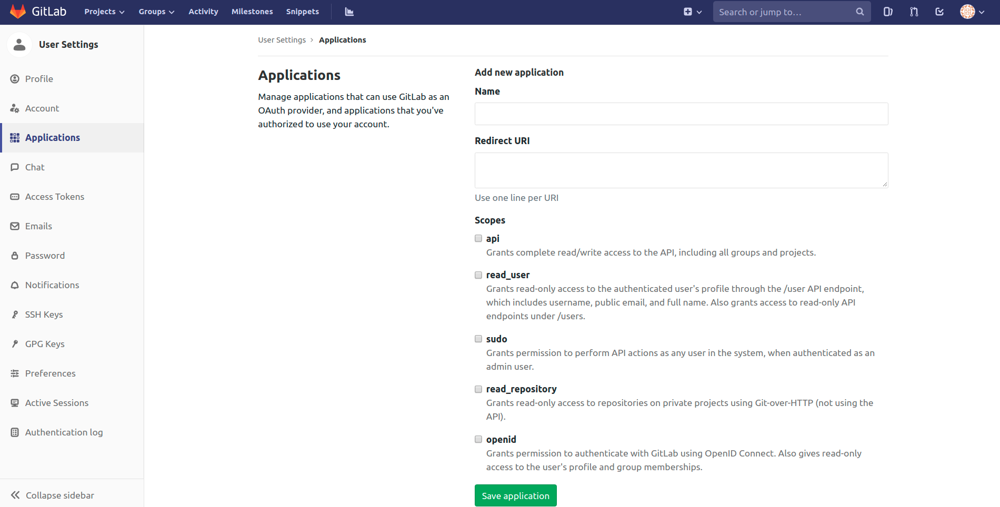

# Drone Deploy

## Prequisite

Installed

- docker
- docker-compose
- One public ip and domain

## ENV

Before running drone, we must set environment.

| Env                        | Description                  |
| -------------------------- | ---------------------------- |
| DRONE_SERVER_HOST          | The hostname of drone        |
| DRONE_GITLAB_SERVER        | The url of gitlab            |
| DRONE_GITLAB_CLIENT_ID     | The application id of gitlab |
| DRONE_GITLAB_CLIENT_SECRET | The secret of gitlab         |
| DRONE_RPC_SECRET               | This is used to authenticate the rpc connection between the server and runners. The server and runner must be provided the same secret value.         |

Get gitlab application id and secret

`user` -> `settings` -> `Applications`



Input `Name` and `http://drone-server-host/login`.
Then mark `api` scopes, final save application

We can get application id and secret in here.

`DRONE_SECRET` and `DRONE_RPC_SECRET` can generate by

```sh
head /dev/urandom | tr -dc A-Za-z0-9 | head -c 36 ; echo ''
```

Set permanent environment to system by editting `/etc/profile`

```sh
vi /etc/profile
```

Add your env, for example

```sh
export DRONE_SERVER_HOST=your-drone-domain
export DRONE_GITLAB_SERVER=https://your.gitlab.com
export DRONE_GITLAB_CLIENT_ID=1234567890abc
export DRONE_GITLAB_CLIENT_SECRET=abcdergdsasdsa
export DRONE_RPC_SECRET=your-drone-rpc-secret
```

Save and exit, update source

```sh
source /etc/profile
```

## Run

```sh
docker-compose up -d
```

## Login

Using browser to `your-drone-domain`, auto redirect authorize page. Then accept authorization and switch on your project.

> Note:
> If using self signed cert, disable SSL verification in gitlab
>
> Enter `Your Project` -> `Settings` -> `Integrations`
> Edit Webphook to disable SSL verification.

Let's start to enjoy drone CI/CD!

## Manage

Use drone-cli to manage drone

If using self signed cert, we must add the cert of drone to our host

```sh
sudo cp auth.crt /usr/local/share/ca-certificates/
sudo update-ca-certificates
```

Then we can use drone-cli to manage drone.

## Tips

### Skip CI

If a new change is intended to commit that don't trigger ci, for example, only modify the document. We can skip ci by adding [CI SKIP], [ci skip] to commit the message.

## More

The more details can see [https://drone.io/](https://drone.io/)
